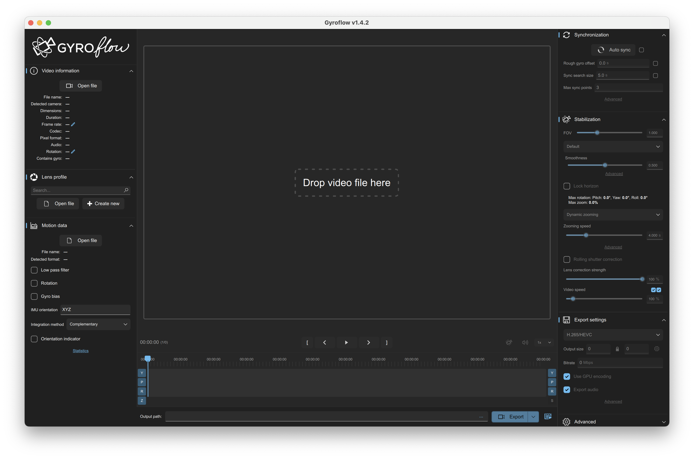

# How To Use

### What is Gyroflow?

[Gyroflow](https://github.com/gyroflow/gyroflow) is a free and open source application that can stabilize your video by using motion data from a gyroscope and optionally an accelerometer. Modern cameras record that data internally (GoPro, Sony, Insta360 etc), and Gyroflow stabilizes the captured footage precisely by using them. It can also use gyro data from an external source (eg. from Betaflight blackbox).

Gyroflow Toolbox allows you to take the stabilised data from Gyroflow and use it within Final Cut Pro as an effect.

    <iframe class="video" src="https://www.youtube-nocookie.com/embed/QAds3x8UU1w?controls=0" title="YouTube video player" frameborder="0" allow="accelerometer; autoplay; clipboard-write; encrypted-media; gyroscope; picture-in-picture; web-share" allowfullscreen></iframe>

---

### Prerequisites

To create the Gyroflow Project (that you import into Gyroflow Toolbox), you'll need to install the latest [Gyroflow](https://gyroflow.xyz/download) application.

You don't necessarily have to install Gyroflow on the same machine as Gyroflow Toolbox - for example, you could run Gyroflow on a fast PC, then copy the exported Gyroflow Project to your Mac to import into Gyroflow Toolbox.

---

### Limitations

You should only ever apply the Gyroflow Toolbox effect to an **entire clip** - the clip cannot be trimmed. Due to limitations in Final Cut Pro's FxPlug4 API - we currently can't determine the source start timecode of a clip. Because of this, the Gyroflow Toolbox effect should only be applied to a clip where the start of the clip hasn't been trimmed in the timeline (i.e. the clip you have in the timeline should show the first frame of the source clip). If you need to trim the start of this clip, you can use the full clip within a Compound Clip, then trim the Compound Clip as required. We have been in contact with the Final Cut Pro team about this, and there's currently no other better workaround or solution. Discussed in [issue 8](https://github.com/latenitefilms/GyroflowToolbox/issues/8).

---

### Test Footage

The Gyroflow team have kindly shared some test footage that contains gyro data on [Google Drive](https://drive.google.com/drive/folders/1sbZiLN5-sv_sGul1E_DUOluB5OMHfySh?usp=sharing).

---

### Supported Gyro Sources

You can find a list of all the current supported gyro sources on the [Gyroflow Repository](https://github.com/gyroflow/gyroflow#supported-gyro-sources).

- GoPro (HERO 5 and later)
- Sony (a1, a7c, a7r IV, a7 IV, a7s III, a9 II, FX3, FX6, FX9, RX0 II, RX100 VII, ZV1, ZV-E10)
- Insta360 (OneR, OneRS, SMO 4k, Go, GO2, Caddx Peanut)
- DJI (Avata, O3 Air Unit)
- Blackmagic RAW (*.braw)
- RED RAW (*.r3d)
- Betaflight blackbox (*.bfl, *.bbl, *.csv)
- ArduPilot logs (*.bin, *.log)
- Gyroflow [.gcsv log](https://docs.gyroflow.xyz/logging/gcsv/)
- iOS apps: [`Sensor Logger`](https://apps.apple.com/us/app/sensor-logger/id1531582925), [`G-Field Recorder`](https://apps.apple.com/at/app/g-field-recorder/id1154585693), [`Gyro`](https://apps.apple.com/us/app/gyro-record-device-motion-data/id1161532981), [`GyroCam`](https://apps.apple.com/us/app/gyrocam-professional-camera/id1614296781)
- Android apps: [`Sensor Logger`](https://play.google.com/store/apps/details?id=com.kelvin.sensorapp&hl=de_AT&gl=US), [`Sensor Record`](https://play.google.com/store/apps/details?id=de.martingolpashin.sensor_record), [`OpenCamera Sensors`](https://github.com/MobileRoboticsSkoltech/OpenCamera-Sensors), [`MotionCam Pro`](https://play.google.com/store/apps/details?id=com.motioncam.pro)
- Runcam CSV (Runcam 5 Orange, iFlight GOCam GR, Runcam Thumb, Mobius Maxi 4K)
- Hawkeye Firefly X Lite CSV
- WitMotion (WT901SDCL binary and *.txt)
- Vuze (VuzeXR)
- KanDao (Obisidian Pro)

---

### How To Use

After you have installed Gyroflow and Gyroflow Toolbox, you'll see a Gyroflow Toolbox Effect in the Effects Browser.

You can then apply this effect to any clips that are supported by Gyroflow.

From the Inspector you can then click **Launch Gyroflow**, to open the Gyroflow application.

Because Gyroflow Toolbox has no knowledge of the clip it's been applied to, we can't automatically load the video clip into Gyroflow, so you'll need to manually import it by either dragging the file in, or clicking the Open File button.

Gyroflow Toolbox also has some limitations with certain footage - for example, currently with the RED Komodo, you'll need to transcode the footage to ProRes, load the ProRes in Gyroflow then load your original `.R3D` in the **Motion data** section of Gyroflow.

Lens profile and Motion data files are automatically detected for some cameras (such as GoPro's). Otherwise search for the correct lens profile and open the Motion data file.

You should play the video to check if additional synchronisation is required. If so, right-click on the timeline and select **Auto sync here** at at least two points of the video where some motion is present. This synchronises the gyro data and the video.

You can also experiment with the stabilisation options and algorithms. They all give different "looks" for the final result.

You can learn more about Gyroflow [here](https://docs.gyroflow.xyz).

The [Gyroflow Discord](https://discord.gg/BBJ2UVAr2D) is also very active and a great way to get fast support.

Once you have finished stabilising in Gyroflow you should click the **Export** button arrow and then **Export project file (including processed gyro data)**.

It's important that you include the **processed gyro data**, otherwise none of the stabilisation will come across to Gyroflow Toolbox, and you'll get an error message when attempting to import it.

You can now press the **Import Project** button in the Final Cut Pro Inspector to import it.

The data from the Gyroflow Project gets saved within the Final Cut Pro library. If you want to reload it, you can either re-import, or if the file is in the same path, you can press **Reload Project**.

You can adjust and keyframe the FOV, Smoothness and Lens Correction within Final Cut Pro.